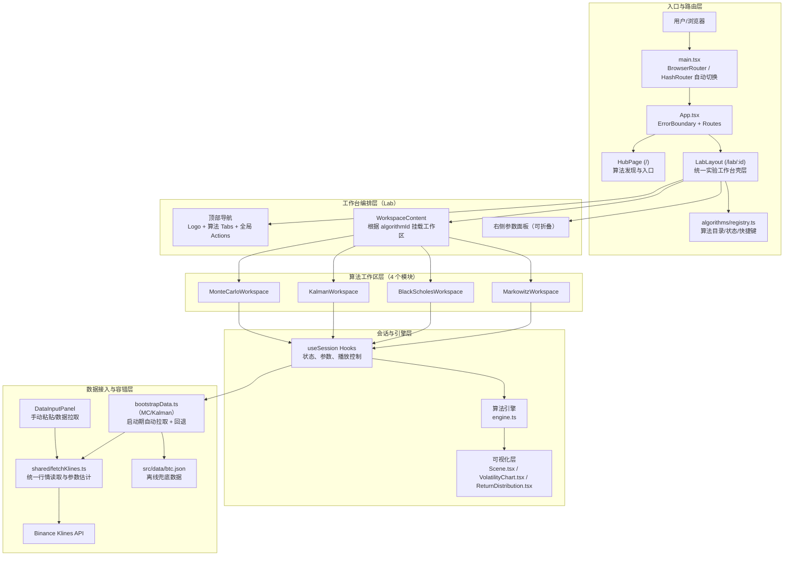
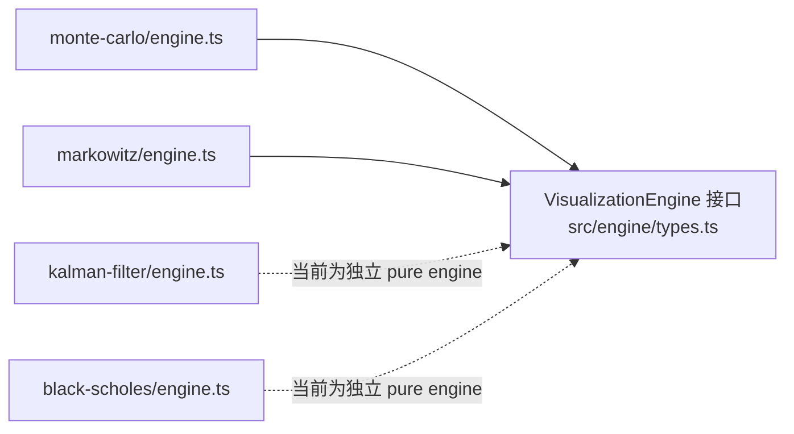

# RiskFlow 3D

> 让复杂的金融风险"看得见、摸得着"

## 这是什么？

RiskFlow 是一个**交互式金融风险可视化实验室**，将抽象的量化金融模型转化为沉浸式的可视化体验。

目前已上线 **Monte Carlo** 与 **Kalman Filter** 两大模块。

### 🎲 Monte Carlo

- 🎲 **收益分布直方图** — 盈亏概率密度与分位线，一眼看懂风险结构
- 📊 **决策指标面板** — 胜率、P50、CVaR95、盈亏比等关键数据实时呈现
- 🔌 **币安 API 接入** — 一键获取 BTC/ETH/SOL 等 20 种主流币种历史数据，自动估算 σ/μ
- 🧪 **风险综合评价** — 基于胜率 × 盈亏比 × 中位收益自动给出入场建议

### 🔍 Kalman Filter

- 📉 **波动率估计** — 基于卡尔曼滤波算法实时追踪隐藏的波动率状态
- 🎛️ **滤波模式** — 支持跟踪 / 平衡 / 平滑三种模式切换
- 📈 **日收益率对比** — 原始日收益率与滤波估计波动率同屏对照

## 解决什么问题？

| 传统方式         | RiskFlow             |
| ---------------- | -------------------- |
| 看不懂的数学公式 | 动态演化的可视化图表 |
| 静态的历史数据   | 基于历史自动推演未来 |
| 专业软件高门槛   | 浏览器打开即用       |
| 手动调参试错     | 快捷预设 + 高级微调  |

## 适用场景

- 📈 **个人投资者** — 评估持仓风险，理解"最坏情况"
- 🎓 **金融学习者** — 直观理解 Monte Carlo、Kalman Filter、VaR、CVaR 等概念
- 💼 **量化从业者** — 快速原型验证，向非技术人员展示风险

## 算法模块

| 模块             | 说明                                                                               | 状态      |
| ---------------- | ---------------------------------------------------------------------------------- | --------- |
| 🎲 Monte Carlo   | 路径扩散与尾部风险 — 观察数千条价格路径如何扩散，直观感受 VaR 与尾部风险的形成过程 | ✅ 已上线 |
| 🔍 Kalman Filter | 噪声中的信号追踪 — 基于卡尔曼滤波实时追踪隐藏的波动率状态                          | ✅ 已上线 |
| 📐 Black-Scholes | 定价曲面与 Greeks — 旋转期权定价曲面，拖动波动率与到期日，感受 Greeks 如何联动变化 | 🚧 开发中 |
| 📊 Markowitz     | 组合优化与有效前沿 — 拖动资产权重，观察有效前沿如何弯曲，理解分散化降低风险的原理  | 🚧 开发中 |

## 全局架构（代码对齐）

> 下图按当前实现绘制（`src/main.tsx` → `src/App.tsx` → `src/pages/lab/LabLayout.tsx`），用于给架构师和产品经理快速理解系统全貌。





> 注：当前代码中的 Lab 结构是“顶部 Tab + 中央舞台 + 右侧面板”；历史方案中的 Left Nav / Bottom Timeline 可作为后续演进方向。

### 架构阅读指引（代码锚点）

| 视角 | 关键代码锚点 | 说明 |
| --- | --- | --- |
| 入口与路由 | `src/main.tsx`、`src/App.tsx` | 负责 Router 选择、全局错误边界、页面路由分发 |
| 工作台壳层 | `src/pages/lab/LabLayout.tsx` | 统一承载算法切换、顶部操作区、右侧面板注入 |
| 算法编排 | `src/pages/lab/*Workspace.tsx`、`src/algorithms/registry.ts` | 通过 `algorithmId` 把产品交互映射到具体算法工作区 |
| 算法内核 | `src/algorithms/*/useSession.ts`、`src/algorithms/*/engine.ts` | 会话状态与计算引擎分离，便于复用与测试 |
| 数据与容错 | `src/algorithms/shared/fetchKlines.ts`、`src/algorithms/*/bootstrapData.ts`、`src/data/btc.json` | 在线数据优先，失败自动回退本地数据 |
| 运行基础设施 | `vite.config.ts` | 提供 `@/` 路径别名与 `/binance-api` 开发代理 |

## 快速开始

```bash
# 安装依赖
yarn install

# 启动开发服务器
yarn dev

# 运行测试
yarn test
```

打开 `http://localhost:5173` 即可使用。

## License

MIT
